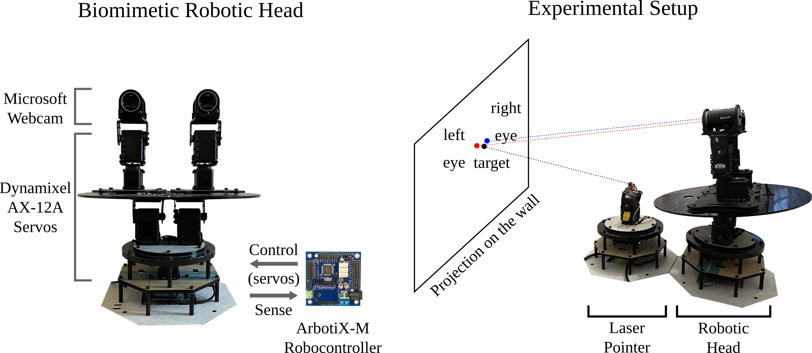

# Spiking Oculomotor Network for Robotic Head Control

This package is the Python and ROS implementation of a spiking neural network on Intel's Loihi neuromorphic processor mimicking the oculomotor system to control a biomimetic robotic head.

The paper is published by IEEE Transactions on Medical Robotics and Bionics (TMRB) in 2022. The published verion is available [here](https://ieeexplore.ieee.org/document/9722907).

## Citation

Ioannis Polykretis, Guangzhi Tang, Praveenram Balachandar and Konstantinos P. Michmizos, **A Spiking Neural Network Mimics the Oculomotor System to Control a Biomimetic Robotic Head without Learning on a Neuromorphic Hardware**, in IEEE Transactions on Medical Robotics and Bionics, vol. 4, no. 2, pp. 520-529, May 2022, doi: 10.1109/TMRB.2022.3155278.

```
@ARTICLE{tmrb-polykretis-spiking,
  author={Polykretis, Ioannis and Tang, Guangzhi and Balachandar, Praveenram and Michmizos, Konstantinos P.},
  journal={IEEE Transactions on Medical Robotics and Bionics}, 
  title={A Spiking Neural Network Mimics the Oculomotor System to Control a Biomimetic Robotic Head Without Learning on a Neuromorphic Hardware}, 
  year={2022},
  volume={4},
  number={2},
  pages={520-529},
  doi={10.1109/TMRB.2022.3155278}}
```

## Hardware Design




## Software Installation


#### 1. Basic Requirements

* Ubuntu 16.04
* Python 3.5.2
* ROS Kinetic
* NxSDK 0.9

ROS Kinetic is not compatible with Python 3 by default, if you have issues with using Python 3 with ROS, please follow this [link](https://medium.com/@beta_b0t/how-to-setup-ros-with-python-3-44a69ca36674) to resolve them. We use the default Python 2 environment to execute `roslaunch` and `rosrun`.

Intel's neuromorphic library NxSDK is required for SNN deployment on Loihi. 
If you are interested in deploying SNNs on Loihi, please contact the [Intel Neuromorphic Lab](https://www.intel.com/content/www/us/en/research/neuromorphic-community.html).


#### 2. Setup Interaction Between ROS and ArbotiX-M

We use ROS as the middleware to control the biomimetic robotic head. To setup the interaction between ROS and the ArbotiX-M robocontroller, we first need to install the arbotix ROS packages from the repository. Please check this [link](http://wiki.ros.org/arbotix_python) on how to interact with the Dynamixel servos using the `arbotix_python` package.

```
sudo apt-get install ros-kinetic-arbotix
```

Next, we need to setup ROS on the ArbotiX-M robocontroller. To program the ArbotiX-M, you can follow the [guide](https://learn.trossenrobotics.com/arbotix/7-arbotix-quick-start-guide) from Trossen Robotics. After setting up the ArbotiX-M robocontroller, open and upload the following sketch in the arbotix library files:

```
File -> Sketchbook -> ArbotiX Sketches -> ros
```

After correctly setting up the software requirements on both the Ubuntu host computer and the ArbotiX-M robocontroller, we connect ArbotiX-M to the host computer using the FTDI-USB cable. To give access to the ROS node, you may need to run (`ttyUSB0` for the robotic head, `ttyUSB1` for the laser pointer):

```
sudo chmod 666 /dev/ttyUSB0
sudo chmod 666 /dev/ttyUSB1
```

Test the interaction setup by running:

```
roslaunch arbotix_head run_arbotix.launch
```

We will have a successful setup if no error is reported.


## Example Usage


#### 1. Bring up Robots and Cameras

We need to first bring up the biomimetic robotic head and the laser pointer after they are connected with the host computer using the FTDI-USB cables. To bring up both robots, you need to first launch the ROS nodes for arbotix interaction:

```
roslaunch arbotix_head run_arbotix.launch
```

Then, set the robotic head to its initial position by executing the following command in a new terminal session (after the head initialization is completed, use Ctrl-C to stop the program):

```
rosrun arbotix_head head_init.py
```

Use the same way to set the laser pointer to its initial position:

```
rosrun arbotix_head laser_pointer_init.py
```

Now we have correctly brought up the robots. Next, we need to bring up the two cameras after they are connected with the host computer using USB cables. To bring up the cameras, you need to launch the ROS nodes for camera video streams and visual input processing in a new terminal session:

```
roslaunch camera_launch microsoft_camera.launch
```

This launch file will simultaneously bring up both the left and the right camera. This will also automatically activate the visual input processing for both cameras, and display the active receptive fields of both eyes.


#### 2. Run Experiments using SNN on Loihi

To control the robotic head, we first deploy the SNN on Loihi and generate control commands by running the following code in the Python3 environment with NxSDK:

```
python head_control.py
```

Then we activate the automatic laser pointer control by running the following code in a new terminal session:

```
python laser_pointer_control.py
```

We designed three different experiments: step response experiment, chirp experiment, and circular experiment. You need to change the parameters in `params.py` to run different experiments. For example, you can change this parameter to run different experiments:

```
cfg['laser']['exp'] = 'step'  # step, circle, or chirp
```

For the chirp and circular experiments, you can also change the parameters to perform the experiments with different frequencies.


#### 3. Record Experiments and Analyze Results

We used RosBag to record the experiments. Please follow this [link](http://wiki.ros.org/rosbag/Tutorials/Recording%20and%20playing%20back%20data) for detailed tutorials on using RosBag.

After the experiments are finished, we execute the following ROS node to compute the projection trajectory for the laser pointer and the eyes using forward kinematics:

```
rosrun head_tf_fk servo_pos_tf_tree.py
```

The computed trajectories will be saved in the `exp_results` folder. We can use the following code to analyze the results:

```
python plot_results.py
```

The code will plot the trajectories and compute the position errors between the laser pointer and the eyes.


### Acknowledgment

This work is supported by Intel's Neuromorphic Research Community Grant Award.
